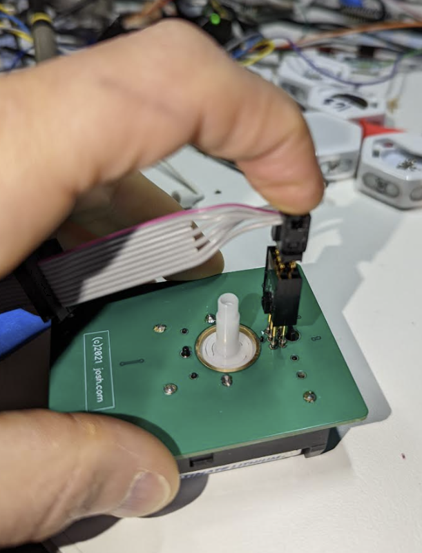

# Programming instructions

## Prerequisites

You will need...

1. A windows computer
2. A `USBTiny` compatible programmer (like this [one](https://amzn.to/3AaaWSp))
3. A connector that fits the clock's 6-pin ISP programming port (like [this](https://amzn.to/3nE2BBh) or [this](https://www.sparkfun.com/products/11591))

Note that you can also use a non-Windows computer or a different programmer, but that would require a different procedure.   

## Setup

1. Copy the files from this directory onto the PC 
2. Plug in the programmer to a USB port on the PC
3. Make sure you hear the nice USB noise telling you the drivers installed OK
4. Make sure the little switch on the programmer board is set to `No Power`

## Procedure

1. Install batteries into clock.  
2. Install the hand pointing to 6 o'clock
2. Hold the connector against the clock board like this...

        
1. Double click on the appropriate programming file in the directory (either `day.bat` or `moon.bat`)
2. Wait for programming success
3. Remove programming connector
4. Push the button
5. Verify that the hand then rotates from 6 o'clock to noon position
6. Finished!

## Checking

One the button has been pressed and the hand has completed its 1/2 revolution, the clock should tick according to this schedule...

| Mode | Full Rotation Period | Tick Every... |
| - | - | - |
| Day | 24 hours | [24 seconds](https://www.wolframalpha.com/input/?i=%28%28day%29+%2F+3600%29+in+seconds) |
| Month | [29.53059 days](https://en.wikipedia.org/wiki/Lunar_month) | [11.812235 minutes](https://www.wolframalpha.com/input/?i=%28%28lunar+month%29+%2F+3600%29+in+minutes) |
| Year | 1 year | [2 hours 26 minutes](https://www.wolframalpha.com/input/?i=%28%28year%29+%2F+3600%29+in+minutes) |

 
## Problems

* Sometimes you need to unplug and replug the programmer into the USB port if the PC has gone to sleep since the last time you used it.
* Make sure all the pins from the programming connector are firmly touching the pads on the clock board.
* Make sure the clock has batteries installed. 
 